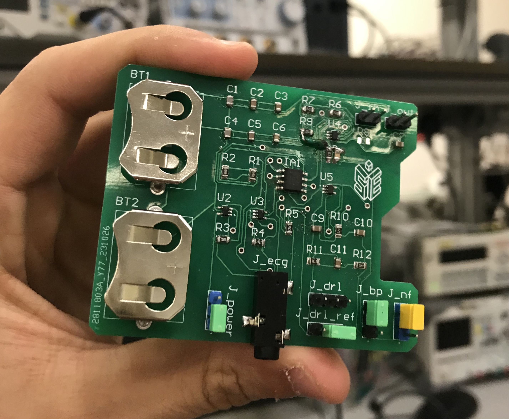
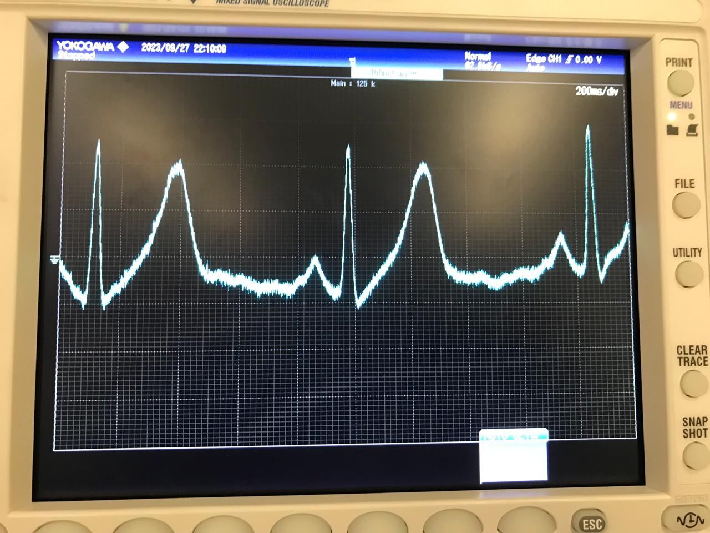
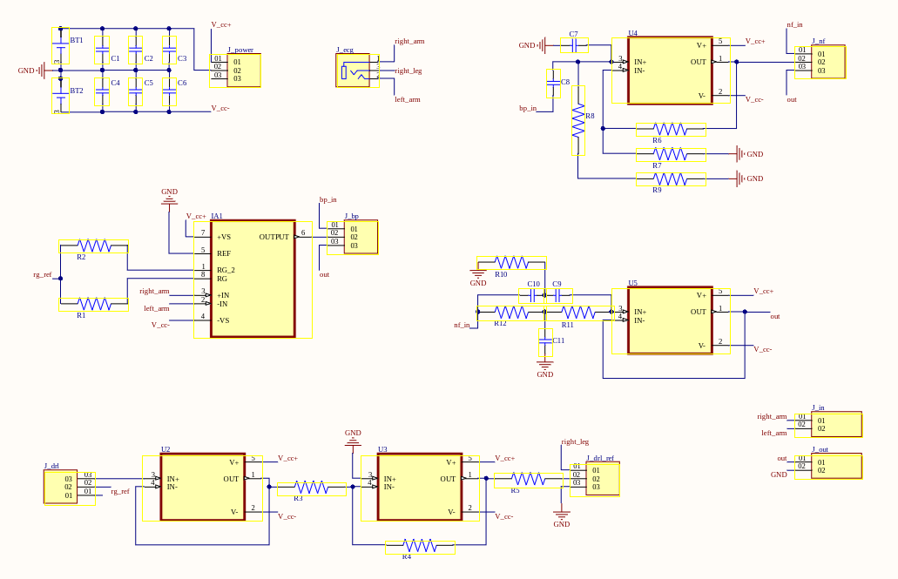
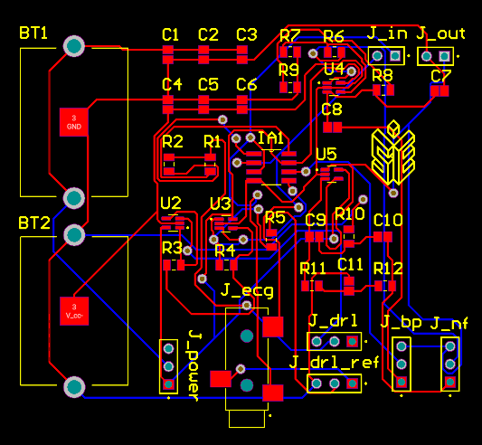
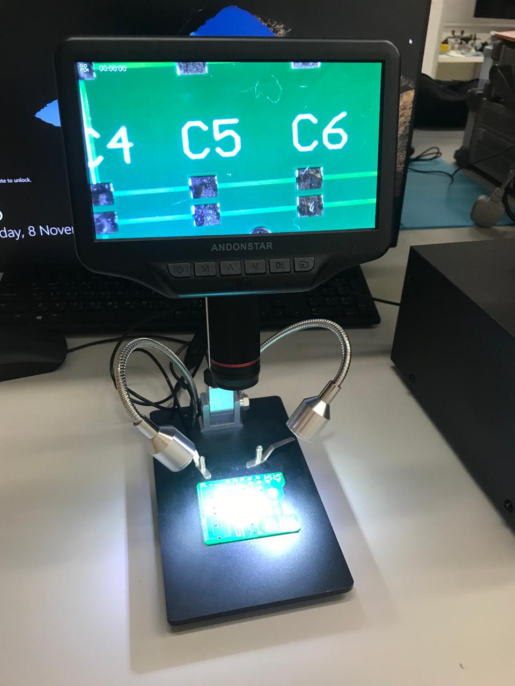

# ElectroCardioGram (ECG) Board &nbsp;  

### Description

This is a pcb board designed, printed and even soldered from scratch with the purpose of plotting my heart beats on an oscilloscope. The final product and the final oscilloscope plots are shown below.
\

I am alive haha.

This entire project was built using Altium Designer.

### Circuit

The circuit is mainly a signal processing circuit, so it consists of an instrumentational amplifier for signal amplification with a drl circuit for noise reduction, after which there are two other stages of signal cleaning: band pass filter and notch filter (to block the AC power frequency noise). Also the circuit includes a capacitor bank that are charged by the batteries and discharge in spikes of current for smooth operation, and a lot of connectors to disconnect and connect every part of the circuit for testing and visualising the contribution of each part of the circuit. The circuit schematic can be seen below.

### PCB

Then on altium the pcb was made to be compact and use as few vias as possible.

### Soldering

Then the surface-mount soldering took place using a microscope-equiped soldering station and the main two soldering methods were practiced: using soldering wire and using solder paste.

Giving our final product shown below once more!

